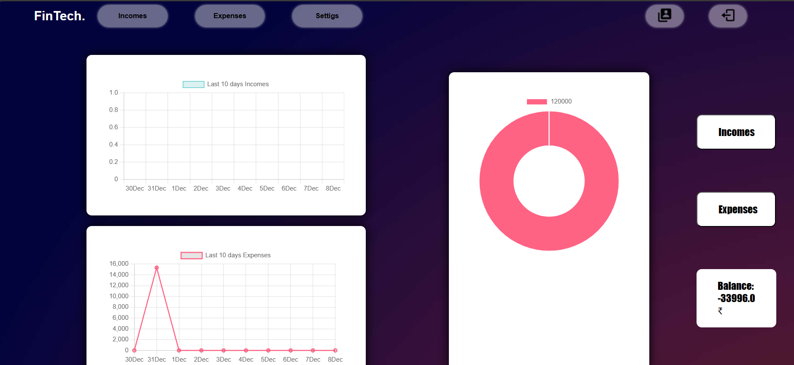

# FinanceTracker
This project is build with the aim to track the finances of an individual
# Setup Virtual Environment
* Create a project directory
* Create a virtual environment using `virtualenv env`
* If you don't have 'virtualenv' then install using `pip install vertualenv`
* Activate Virtual Env using `.\env\Scripts\activate`
* If get access restrictions Error on Windows. Run this cmd `Set-ExecutionPolicy Unrestricted -Scope Process` The try again to activate Env

# Setup Project
* Clone This Git Repo `git clone https://github.com/agnt17/FinTRA`
* Change directory `cd FinanceTracker`
* Install dependencies from requirements.txt
* `pip install -r requirements.txt`

# Start project
* Start project using `python manage.py runserver`

# Glance of the project

